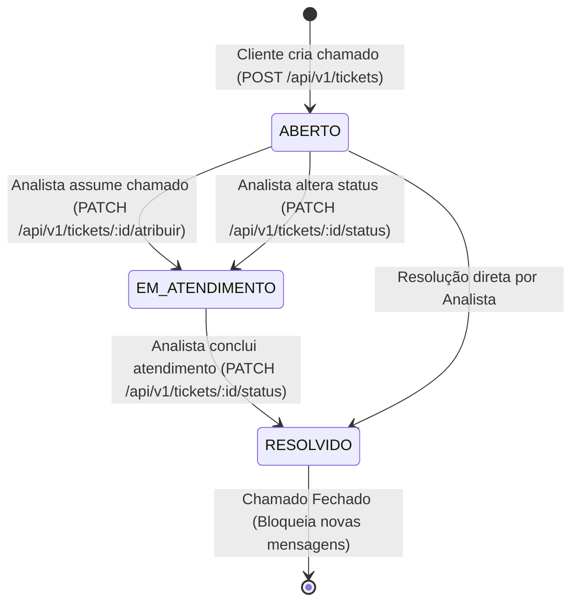

# 🎫 ConnectTickets — API de Gestão de Tickets & Helpdesk

<div align="center">


**Avaliação Parcial (P1) — Engenharia de Software / Desenvolvimento Web 2026.1**  
*API RESTful desenvolvida com Clean Architecture, TypeScript, In-Memory Database com Seed Data, Swagger UI e Wireframes.*

</div>

---

## 📑 Sumário

- [1. Visão Geral do Projeto](#-1-visão-geral-do-projeto)
- [2. Perfis de Usuário e Permissões](#-2-perfis-de-usuário-e-matriz-de-permissões)
- [3. Ciclo de Vida do Ticket](#-3-ciclo-de-vida-do-ticket)
- [4. Arquitetura do Sistema (5 Camadas)](#-4-arquitetura-do-sistema-5-camadas)
- [5. Guia de Instalação e Execução](#-5-guia-de-instalação-e-execução-passo-a-passo)
- [6. Endpoints da API RESTful](#-6-endpoints-da-api-restful)
- [7. Guia de Testes (Swagger UI, Postman e Newman)](#-7-guia-de-testes-da-api)
- [8. Wireframes da Interface](#-8-wireframes-da-interface)
- [9. Dados Pré-Cadastrados (Seed Data)](#-9-dados-pré-cadastrados-seed-data)
- [10. Licença](#-10-licença)

---

## 📌 1. Visão Geral do Projeto

O **ConnectTickets** é uma solução completa de Helpdesk / Service Desk para suporte técnico corporativo. A aplicação centraliza todo o fluxo de abertura, triagem, atendimento e resolução de incidentes tecnológicos entre **Clientes** (solicitantes) e **Analistas** (técnicos de suporte).

### Principais Destaques:
- **Separação de Perfis:** Validação estrita entre `CLIENTE` e `ANALISTA`.
- **Ciclo de Vida Controlado:** Transições de estado automáticas e unidirecionais (`ABERTO` $\rightarrow$ `EM_ATENDIMENTO` $\rightarrow$ `RESOLVIDO`).
- **Fila Operacional de Pendentes:** Endpoint otimizado com filtro de prioridade para a equipe técnica.
- **Histórico & Logs de Mensagens:** Auditoria cronológica e troca de mensagens em tempo real no ticket.
- **Swagger / OpenAPI Dinâmico:** Documentação viva servida diretamente pela aplicação com exportação JSON.

---

## 👥 2. Perfis de Usuário e Matriz de Permissões

| Operação / Endpoint | Perfil `CLIENTE` | Perfil `ANALISTA` | Regra de Validação |
|---|:---:|:---:|---|
| **Abrir novo chamado** (`POST /api/v1/tickets`) | ✅ **Permitido** | ❌ **Bloqueado** | Analistas não podem ser definidos como cliente solicitante (`400 Bad Request`). |
| **Listar / Consultar chamados** | ✅ **Permitido** | ✅ **Permitido** | Visualização completa do histórico e detalhes. |
| **Visualizar fila de pendentes** (`GET /api/v1/tickets/pendentes`) | ✅ **Permitido** | ✅ **Permitido** | Retorna chamados em `ABERTO` e `EM_ATENDIMENTO`. |
| **Assumir / Atribuir analista** (`PATCH /tickets/:id/atribuir`) | ❌ **Bloqueado** | ✅ **Permitido** | Atualiza automaticamente o status para `EM_ATENDIMENTO`. |
| **Alterar status / Resolver ticket** (`PATCH /tickets/:id/status`) | ❌ **Bloqueado** | ✅ **Permitido** | Apenas analistas podem alterar status ou finalizar como `RESOLVIDO`. |
| **Enviar mensagem em ticket aberto** (`POST /tickets/:id/mensagens`) | ✅ **Permitido** | ✅ **Permitido** | Interação registrada com identificação do autor e perfil. |
| **Enviar mensagem em ticket resolvido** | ❌ **Bloqueado** | ❌ **Bloqueado** | Tickets com status `RESOLVIDO` são fechados definitivamente (`400 Bad Request`). |
| **Cadastrar novo usuário** (`POST /api/v1/usuarios`) | ✅ **Permitido** | ✅ **Permitido** | Evita duplicação de e-mails corporativos. |

---

## 🔄 3. Ciclo de Vida do Ticket



---

## 🏛️ 4. Arquitetura do Sistema (5 Camadas)

O projeto segue os padrões de **Clean Architecture** e princípios **SOLID**:

```text
ConnectTickets/
├── postman/
│   └── collections/
│       └── ConnectTickets.postman_collection.json  # Coleção Postman v2.1
├── wireframes/
│   ├── 01-painel-tickets.svg                      # Dashboard & Painel Geral
│   ├── 02-abertura-ticket.svg                     # Abertura de Chamado
│   ├── 03-atendimento-chat.svg                    # Chat & Detalhes do Ticket
│   └── 04-gestao-usuarios.svg                     # Gestão de Usuários e Perfis
├── docs/
│   └── WIREFRAMES.md                              # Mapeamento Tela <-> API
├── src/
│   ├── entities/                                  # 1. Domínio & Tipos Puros
│   │   ├── Usuario.ts
│   │   ├── Ticket.ts
│   │   └── Mensagem.ts
│   ├── repositories/                              # 2. Contratos de Repositório
│   │   ├── IUsuarioRepository.ts
│   │   ├── ITicketRepository.ts
│   │   └── IMensagemRepository.ts
│   ├── services/                                  # 3. Casos de Uso & Regras
│   │   ├── dtos/
│   │   │   ├── UsuarioDTOs.ts
│   │   │   ├── TicketDTOs.ts
│   │   │   └── MensagemDTOs.ts
│   │   ├── UsuarioService.ts
│   │   ├── TicketService.ts
│   │   └── MensagemService.ts
│   ├── interfaces/                                # 4. Adaptadores de Interface
│   │   └── controllers/
│   │       ├── UsuarioController.ts
│   │       ├── TicketController.ts
│   │       └── MensagemController.ts
│   ├── factories/                                 # Injeção de Dependências
│   │   ├── UsuarioFactory.ts
│   │   ├── TicketFactory.ts
│   │   └── MensagemFactory.ts
│   └── infrastructure/                            # 5. Frameworks & Infra
│       ├── database/                              # Repositórios In-Memory + Seed
│       │   ├── UsuarioRepositoryInMemory.ts
│       │   ├── TicketRepositoryInMemory.ts
│       │   └── MensagemRepositoryInMemory.ts
│       └── http/                                  # Express Server + Swagger
│           ├── docs/
│           │   ├── schemas.yaml
│           │   └── swagger.ts
│           ├── routes/
│           │   ├── usuarios.routes.ts
│           │   ├── tickets.routes.ts
│           │   ├── mensagens.routes.ts
│           │   └── docs.routes.ts
│           └── server.ts
├── ConnectTickets.postman_collection.json         # Coleção raiz para importação
├── ConnectTickets.postman_test_run.json           # Relatório de testes automatizados
├── package.json
└── tsconfig.json
```

---

## 🚀 5. Guia de Instalação e Execução (Passo a Passo)

### 📋 Pré-requisitos
- **Node.js** (versão 18.x ou superior recomendada) $\rightarrow$ [Download Node.js](https://nodejs.org/)
- **npm** (versão 9.x ou superior) ou **yarn**
- **Git** $\rightarrow$ [Download Git](https://git-scm.com/)

---

### 📥 1. Clonar o Repositório

Abra o seu terminal (Prompt de Comando, PowerShell ou Terminal do VS Code) e execute:

```bash
git clone https://github.com/Desenvolvimento-Web-2026-1-ENG/ConnectTickets.git
cd ConnectTickets
```

---

### 📦 2. Instalar as Dependências

Instale todos os pacotes de produção e desenvolvimento configurados no `package.json`:

```bash
npm install
```

---

### 💻 3. Executar em Modo de Desenvolvimento

Para iniciar o servidor com recarregamento automático (*hot-reload*) via `tsx`:

```bash
npm run dev
```

Você verá a confirmação no terminal:
```text
====================================================
🚀 ConnectTickets API rodando em: http://localhost:3000
📚 Swagger UI disponível em:      http://localhost:3000/api-docs
📄 Especificação OpenAPI JSON em:  http://localhost:3000/api-docs/json
====================================================
```

---

### 🏗️ 4. Compilar para Produção (Build)

Para realizar a compilação TypeScript e resolver os *Path Aliases* com `tsc-alias`:

```bash
npm run build
```
*Os arquivos JavaScript compilados serão gerados no diretório `dist/`.*

---

### 🟢 5. Executar a Versão de Produção Compilada

Após o build, execute:

```bash
npm start
```

---

## 📡 6. Endpoints da API RESTful

Todas as rotas da API possuem o prefixo base `/api/v1`:

| Método | Endpoint | Descrição | Status Sucesso | Status Erro |
|:---:|---|---|:---:|:---:|
| **GET** | `/api/v1/usuarios` | Lista todos os usuários (aceita filtro `?perfil=CLIENTE` ou `ANALISTA`) | `200 OK` | `400` |
| **GET** | `/api/v1/usuarios/:id` | Busca detalhes de um usuário por ID | `200 OK` | `404`, `400` |
| **POST** | `/api/v1/usuarios` | Cadastra um novo usuário (`nome`, `email`, `perfil`) | `201 Created` | `400` |
| **GET** | `/api/v1/tickets` | Lista tickets com suporte a filtros (`?status=`, `?prioridade=`, `?clienteId=`, `?analistaId=`) | `200 OK` | `400` |
| **GET** | `/api/v1/tickets/pendentes` | Painel rápido de chamados pendentes (`ABERTO` e `EM_ATENDIMENTO`) com filtro `?prioridade=` | `200 OK` | `400` |
| **GET** | `/api/v1/tickets/:id` | Detalhes completos do ticket (com dados do cliente, analista e mensagens) | `200 OK` | `404`, `400` |
| **POST** | `/api/v1/tickets` | Abertura de chamado (exclusivo para perfil `CLIENTE`) | `201 Created` | `400` |
| **PATCH** | `/api/v1/tickets/:id/atribuir` | Atribui analista ao ticket (muda status para `EM_ATENDIMENTO`) | `200 OK` | `400`, `404` |
| **PATCH** | `/api/v1/tickets/:id/status` | Altera status (`ABERTO` $\rightarrow$ `EM_ATENDIMENTO` $\rightarrow$ `RESOLVIDO`). Exige `usuarioId` de `ANALISTA` | `200 OK` | `400`, `404` |
| **DELETE** | `/api/v1/tickets/:id` | Exclui um ticket do sistema | `204 No Content` | `404`, `400` |
| **GET** | `/api/v1/tickets/:id/mensagens` | Lista histórico cronológico de mensagens e logs do ticket | `200 OK` | `404`, `400` |
| **POST** | `/api/v1/tickets/:id/mensagens` | Envia mensagem / log no ticket (`autorId`, `conteudo`) | `201 Created` | `400`, `404` |
| **GET** | `/api-docs` | Interface gráfica interativa do **Swagger UI** | `200 OK` | - |
| **GET** | `/api-docs/json` | Especificação OpenAPI em formato **JSON** | `200 OK` | - |

---

## 🧪 7. Guia de Testes da API

### Opção A: Testar via Swagger UI (Navegador)
1. Com a API rodando (`npm run dev`), acesse:  
   👉 **[http://localhost:3000/api-docs](http://localhost:3000/api-docs)**
2. Clique no endpoint desejado $\rightarrow$ **Try it out** $\rightarrow$ **Execute**.

---

### Opção B: Testar via Postman Desktop
1. Abra o **Postman**.
2. Clique em **File** $\rightarrow$ **Import** (ou `Ctrl + O`).
3. Selecione o arquivo [`ConnectTickets.postman_collection.json`](./ConnectTickets.postman_collection.json) localizado na raiz do projeto.
4. Execute as requisições organizadas por pastas (**Usuários**, **Tickets**, **Mensagens**).

---

### Opção C: Executar Testes Automatizados via Linha de Comando (Newman)
Com o servidor rodando em outro terminal, execute no terminal do projeto:

```bash
npx newman run ConnectTickets.postman_collection.json -r json,cli --reporter-json-export ConnectTickets.postman_test_run.json
```

**Resultado dos Testes Automatizados:**
- ✅ **12 requisições executadas com sucesso**
- ✅ **23 asserções de regras de negócio aprovadas (0 falhas)**
- 📄 Relatório completo salvo em [`ConnectTickets.postman_test_run.json`](./ConnectTickets.postman_test_run.json).

---

## 🎨 8. Wireframes da Interface

Os protótipos em vetor SVG e a documentação de integração com a API encontram-se em:

- 📊 **Painel Geral de Tickets:** [`wireframes/01-painel-tickets.svg`](./wireframes/01-painel-tickets.svg)
- ➕ **Abertura de Chamado:** [`wireframes/02-abertura-ticket.svg`](./wireframes/02-abertura-ticket.svg)
- 💬 **Atendimento & Chat:** [`wireframes/03-atendimento-chat.svg`](./wireframes/03-atendimento-chat.svg)
- 👥 **Gestão de Usuários:** [`wireframes/04-gestao-usuarios.svg`](./wireframes/04-gestao-usuarios.svg)
- 📖 **Documentação Técnica & Mapeamento:** [`docs/WIREFRAMES.md`](./docs/WIREFRAMES.md)

---

## 🧪 9. Dados Pré-Cadastrados (Seed Data)

### Usuários de Exemplo:
- **ID 1:** `Carlos Silva` (`CLIENTE`) — `carlos.silva@empresa.com`
- **ID 2:** `Mariana Souza` (`CLIENTE`) — `mariana.souza@empresa.com`
- **ID 3:** `Roberto Tech` (`ANALISTA`) — `roberto.tech@suporte.com`
- **ID 4:** `Fernanda Help` (`ANALISTA`) — `fernanda.help@suporte.com`

### Tickets de Exemplo:
- **ID 1:** *"Falha na conexão com a VPN corporativa"* (`Redes` / `ALTA` / `ABERTO` / Cliente: 1)
- **ID 2:** *"Computador não liga após queda de energia"* (`Hardware` / `CRITICA` / `EM_ATENDIMENTO` / Cliente: 2 / Analista: 3)
- **ID 3:** *"Solicitação de licença do software CAD"* (`Software` / `MEDIA` / `RESOLVIDO` / Cliente: 1 / Analista: 4)
- **ID 4:** *"Redefinição de senha do portal de RH"* (`Acesso` / `BAIXA` / `ABERTO` / Cliente: 2)

---

## 📄 10. Licença

Este projeto é distribuído sob a licença **MIT**. Consulte o arquivo [`LICENSE`](./LICENSE) para mais informações.