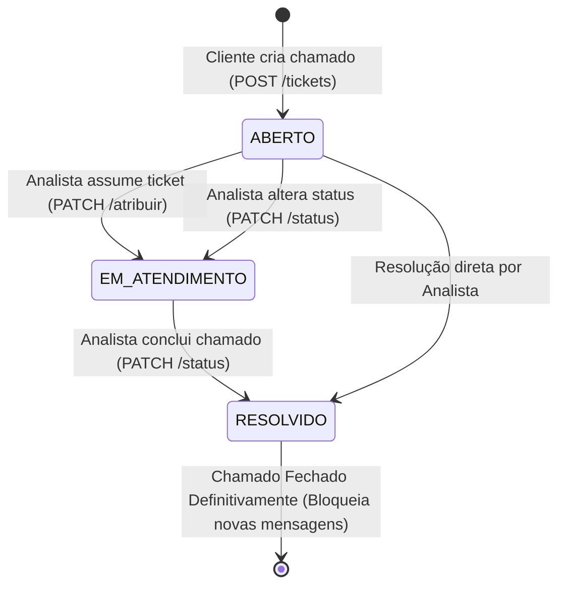

# 🎫 ConnectTickets — API de Gestão de Tickets & Helpdesk

> **Projeto Avaliação Parcial (P1) — Desenvolvimento Web 2026.1**  
> API RESTful robusta desenvolvida em **Node.js**, **TypeScript**, **Express** e **Clean Architecture**, com documentação OpenAPI interativa (**Swagger UI**) e especificações visuais de interface (**Wireframes**).

---

## 📌 1. Visão Geral do Projeto

O **ConnectTickets** é uma solução completa de Helpdesk / Service Desk para suporte técnico empresarial. O sistema centraliza a comunicação entre colaboradores que necessitam de suporte técnico (**Clientes**) e a equipe responsável pela triagem, diagnóstico e resolução dos incidentes (**Analistas**).

### Principais Funcionalidades:
- **Gestão de Perfis:** Controle de acesso estrito entre `CLIENTE` e `ANALISTA`.
- **Ciclo de Vida de Chamados:** Fluxo controlado de estados (`ABERTO` $\rightarrow$ `EM_ATENDIMENTO` $\rightarrow$ `RESOLVIDO`).
- **Fila Operacional de Pendentes:** Painel com filtragem por prioridade para triagem rápida de tickets.
- **Histórico & Logs de Mensagens:** Registro cronológico de mensagens e auditoria por chamado.
- **Documentação OpenAPI Integrada:** Swagger UI nativo com esquemas de validação e exportação JSON para Postman.

---

## 👥 2. Perfis de Usuário e Matriz de Permissões

O sistema opera com dois perfis de acesso bem definidos:

| Funcionalidade / Operação | Perfil `CLIENTE` | Perfil `ANALISTA` |
|---|:---:|:---:|
| **Abrir novo chamado** (`POST /api/v1/tickets`) | ✅ Permitido | ❌ Bloqueado (`400 Bad Request`) |
| **Consultar seus próprios chamados** | ✅ Permitido | ✅ Permitido |
| **Visualizar fila de pendentes** (`GET /api/v1/tickets/pendentes`) | ✅ Permitido | ✅ Permitido |
| **Assumir chamado / Atribuir analista** (`PATCH /tickets/:id/atribuir`) | ❌ Bloqueado | ✅ Permitido |
| **Alterar status & Resolver chamado** (`PATCH /tickets/:id/status`) | ❌ Bloqueado (`400 Bad Request`) | ✅ Permitido |
| **Adicionar mensagem em ticket aberto** (`POST /tickets/:id/mensagens`) | ✅ Permitido | ✅ Permitido |
| **Adicionar mensagem em ticket resolvido** | ❌ Bloqueado | ❌ Bloqueado (`400 Bad Request`) |
| **Cadastrar novo usuário** (`POST /api/v1/usuarios`) | ✅ Permitido | ✅ Permitido |

---

## 🔄 3. Ciclo de Vida do Ticket

Todo ticket passa por um fluxo formal e unidirecional de estados:



### Regras do Ciclo de Vida:
1. **`ABERTO`:** Estado inicial automático de qualquer chamado criado por um `CLIENTE`. O campo `analistaId` permanece nulo/indefinido.
2. **`EM_ATENDIMENTO`:** Ocorre automaticamente quando um `ANALISTA` assume o chamado ou é atribuído a ele.
3. **`RESOLVIDO`:** Somente usuários com perfil `ANALISTA` podem alterar o status para `RESOLVIDO`. Uma vez resolvido, o ticket é fechado e nenhuma mensagem nova pode ser enviada.

---

## 🏛️ 4. Arquitetura do Sistema (5 Camadas)

O projeto adota os princípios de **Clean Architecture** e **Inversão de Dependência (SOLID)**:

```text
src/
├── entities/                   # 1. Camada de Domínio (Entidades e Tipos puros)
│   ├── Usuario.ts
│   ├── Ticket.ts
│   └── Mensagem.ts
├── repositories/               # 2. Camada de Contratos de Dados (Interfaces)
│   ├── IUsuarioRepository.ts
│   ├── ITicketRepository.ts
│   └── IMensagemRepository.ts
├── services/                   # 3. Camada de Casos de Uso & Regras de Negócio
│   ├── dtos/                   #    Data Transfer Objects (DTOs)
│   │   ├── UsuarioDTOs.ts
│   │   ├── TicketDTOs.ts
│   │   └── MensagemDTOs.ts
│   ├── UsuarioService.ts
│   ├── TicketService.ts
│   └── MensagemService.ts
├── interfaces/                 # 4. Camada de Adaptadores de Interface
│   └── controllers/            #    Controladores HTTP Express
│       ├── UsuarioController.ts
│       ├── TicketController.ts
│       └── MensagemController.ts
├── factories/                  #    Injeção de Dependências (Composition Root)
│   ├── UsuarioFactory.ts
│   ├── TicketFactory.ts
│   └── MensagemFactory.ts
└── infrastructure/             # 5. Camada de Infraestrutura e Frameworks
    ├── database/               #    Implementações In-Memory com Seed Data
    │   ├── UsuarioRepositoryInMemory.ts
    │   ├── TicketRepositoryInMemory.ts
    │   └── MensagemRepositoryInMemory.ts
    └── http/                   #    Servidor Express, Rotas e Swagger
        ├── docs/
        │   ├── schemas.yaml    # Definições de Schemas OpenAPI
        │   └── swagger.ts      # Configuração do swagger-jsdoc
        ├── routes/
        │   ├── usuarios.routes.ts
        │   ├── tickets.routes.ts
        │   ├── mensagens.routes.ts
        │   └── docs.routes.ts
        └── server.ts
```

---

## 📡 5. Tabela Completa de Endpoints da API

A API é prefixada por `/api/v1` e segue o padrão RESTful:

| Método | Endpoint | Descrição | Corpo da Requisição (Payload) | Respostas (Status Codes) |
|:---:|---|---|---|---|
| **GET** | `/api/v1/usuarios` | Lista usuários cadastrados (filtro `?perfil=`) | *Nenhum* | `200 OK`, `400 Bad Request` |
| **GET** | `/api/v1/usuarios/:id` | Busca usuário específico por ID | *Nenhum* | `200 OK`, `404 Not Found`, `400 Bad Request` |
| **POST** | `/api/v1/usuarios` | Cadastra novo usuário | `CriarUsuarioDTO` (`nome`, `email`, `perfil`) | `201 Created`, `400 Bad Request` |
| **GET** | `/api/v1/tickets` | Lista tickets com suporte a filtros (`?status=`, `?prioridade=`, `?clienteId=`, `?analistaId=`) | *Nenhum* | `200 OK`, `400 Bad Request` |
| **GET** | `/api/v1/tickets/pendentes` | Fila rápida de tickets pendentes (`ABERTO` e `EM_ATENDIMENTO`) | *Nenhum* (filtro opcional `?prioridade=`) | `200 OK`, `400 Bad Request` |
| **GET** | `/api/v1/tickets/:id` | Detalhes completos do ticket (com dados do cliente, analista e mensagens) | *Nenhum* | `200 OK`, `404 Not Found`, `400 Bad Request` |
| **POST** | `/api/v1/tickets` | Abertura de chamado (exclusivo para perfil `CLIENTE`) | `CriarTicketDTO` (`titulo`, `descricao`, `categoria`, `prioridade`, `clienteId`) | `201 Created`, `400 Bad Request` |
| **PATCH** | `/api/v1/tickets/:id/atribuir` | Atribui ticket a um analista (muda status para `EM_ATENDIMENTO`) | `AtribuirTicketDTO` (`analistaId`) | `200 OK`, `400 Bad Request`, `404 Not Found` |
| **PATCH** | `/api/v1/tickets/:id/status` | Altera o status do ticket (exclusivo para perfil `ANALISTA`) | `AlterarStatusDTO` (`novoStatus`, `usuarioId`) | `200 OK`, `400 Bad Request`, `404 Not Found` |
| **DELETE** | `/api/v1/tickets/:id` | Remove um ticket do sistema | *Nenhum* | `204 No Content`, `404 Not Found`, `400 Bad Request` |
| **GET** | `/api/v1/tickets/:id/mensagens` | Lista histórico de mensagens e logs do ticket | *Nenhum* | `200 OK`, `404 Not Found`, `400 Bad Request` |
| **POST** | `/api/v1/tickets/:id/mensagens` | Envia mensagem / log no ticket | `CriarMensagemDTO` (`autorId`, `conteudo`) | `201 Created`, `400 Bad Request`, `404 Not Found` |
| **GET** | `/api-docs` | Interface gráfica interativa do **Swagger UI** | *Nenhum* | `200 OK` |
| **GET** | `/api-docs/json` | Especificação OpenAPI em formato **JSON** (para importação no Postman) | *Nenhum* | `200 OK` |

---

## 🎨 6. Wireframes e Mapeamento de Telas

O projeto inclui protótipos de interface vetoriais detalhados no diretório [`wireframes/`](./wireframes/) e documentação em [`docs/WIREFRAMES.md`](./docs/WIREFRAMES.md):

| Protótipo | Arquivo | Descrição | Endpoints REST Integrados |
|---|---|---|---|
| **01. Painel Geral** | [`wireframes/01-painel-tickets.svg`](./wireframes/01-painel-tickets.svg) | Dashboard com métricas, filtros de prioridade/status e listagem geral de tickets. | `GET /api/v1/tickets`<br>`GET /api/v1/tickets/pendentes`<br>`PATCH /api/v1/tickets/:id/atribuir`<br>`DELETE /api/v1/tickets/:id` |
| **02. Abertura de Ticket** | [`wireframes/02-abertura-ticket.svg`](./wireframes/02-abertura-ticket.svg) | Formulário com seleção de cliente, categoria, prioridade em botões e descrição. | `POST /api/v1/tickets`<br>`GET /api/v1/usuarios?perfil=CLIENTE` |
| **03. Atendimento & Chat** | [`wireframes/03-atendimento-chat.svg`](./wireframes/03-atendimento-chat.svg) | Tela de detalhes com controles operacionais do analista e timeline interativa de conversas. | `GET /api/v1/tickets/:id`<br>`GET /api/v1/tickets/:id/mensagens`<br>`POST /api/v1/tickets/:id/mensagens`<br>`PATCH /api/v1/tickets/:id/status` |
| **04. Gestão de Usuários** | [`wireframes/04-gestao-usuarios.svg`](./wireframes/04-gestao-usuarios.svg) | Cadastro de usuários e listagem com filtros por perfil (`CLIENTE` ou `ANALISTA`). | `GET /api/v1/usuarios`<br>`POST /api/v1/usuarios` |

---

## 🚀 7. Instruções de Instalação e Execução

### Pré-requisitos:
- **Node.js** v18+ ou superior
- **npm** v9+ ou superior

### Passo a Passo:

1. **Clone o repositório:**
   ```bash
   git clone https://github.com/Desenvolvimento-Web-2026-1-ENG/ConnectTickets.git
   cd ConnectTickets
   ```

2. **Instale as dependências:**
   ```bash
   npm install
   ```

3. **Executar em Modo de Desenvolvimento (com hot-reload via `tsx`):**
   ```bash
   npm run dev
   ```

4. **Compilar para Produção (TypeScript + Resolução de Aliases):**
   ```bash
   npm run build
   ```

5. **Executar a Versão Compilada:**
   ```bash
   npm start
   ```

---

## 📖 8. Acesso à Documentação Swagger

Com a aplicação em execução, acesse em seu navegador:

- **Swagger UI Interativo:** [http://localhost:3000/api-docs](http://localhost:3000/api-docs)
- **OpenAPI JSON Spec:** [http://localhost:3000/api-docs/json](http://localhost:3000/api-docs/json)

---

## 🧪 9. Dados Pré-Cadastrados (*Seed Data*) para Testes Imediatos

Ao iniciar a API, os seguintes dados de exemplo estão pré-carregados:

### Usuários de Teste:
- **ID 1:** `Carlos Silva` (`CLIENTE`) — `carlos.silva@empresa.com`
- **ID 2:** `Mariana Souza` (`CLIENTE`) — `mariana.souza@empresa.com`
- **ID 3:** `Roberto Tech` (`ANALISTA`) — `roberto.tech@suporte.com`
- **ID 4:** `Fernanda Help` (`ANALISTA`) — `fernanda.help@suporte.com`

### Tickets de Teste:
- **ID 1:** *"Falha na conexão com a VPN corporativa"* — Categoria: `Redes` | Prioridade: `ALTA` | Status: `ABERTO` | Cliente: ID 1
- **ID 2:** *"Computador não liga após queda de energia"* — Categoria: `Hardware` | Prioridade: `CRITICA` | Status: `EM_ATENDIMENTO` | Cliente: ID 2 | Analista: ID 3
- **ID 3:** *"Solicitação de licença do software CAD"* — Categoria: `Software` | Prioridade: `MEDIA` | Status: `RESOLVIDO` | Cliente: ID 1 | Analista: ID 4
- **ID 4:** *"Redefinição de senha do portal de RH"* — Categoria: `Acesso` | Prioridade: `BAIXA` | Status: `ABERTO` | Cliente: ID 2

---

## 📄 Licença

Distribuído sob a licença MIT. Veja o arquivo [`LICENSE`](./LICENSE) para mais detalhes.