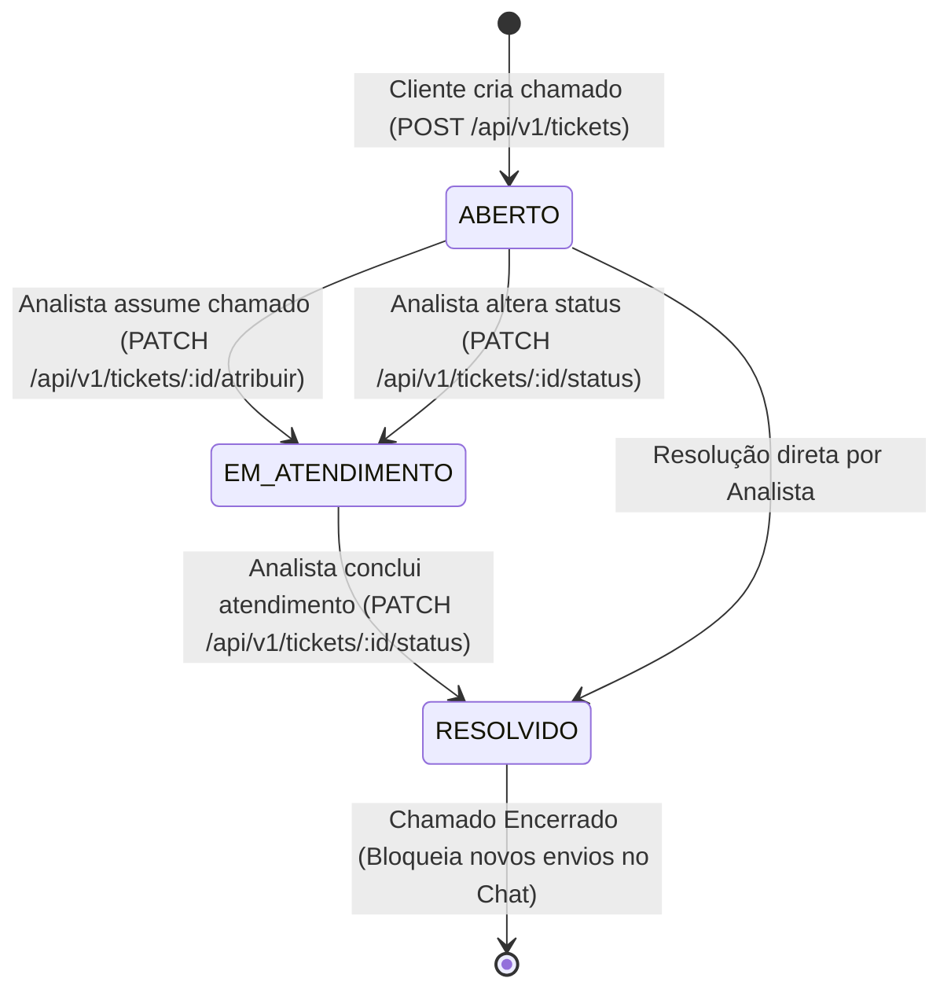
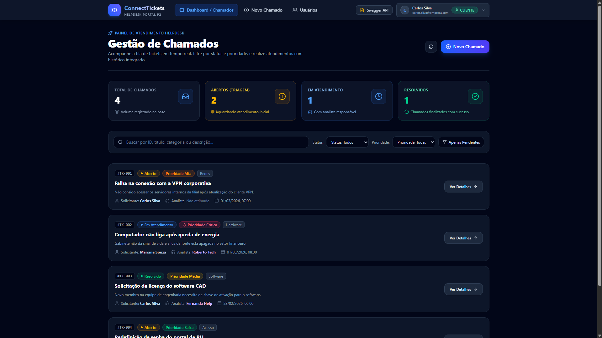
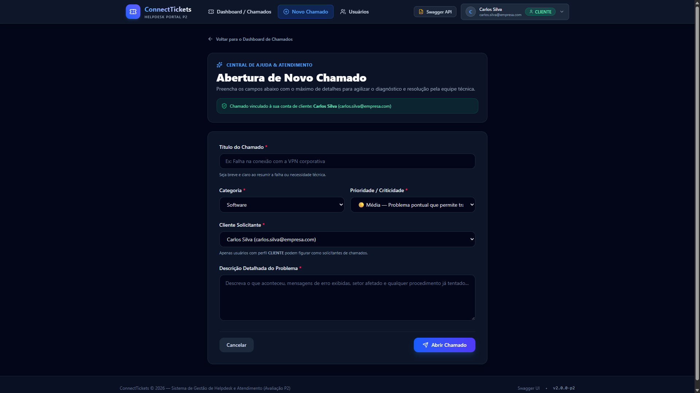
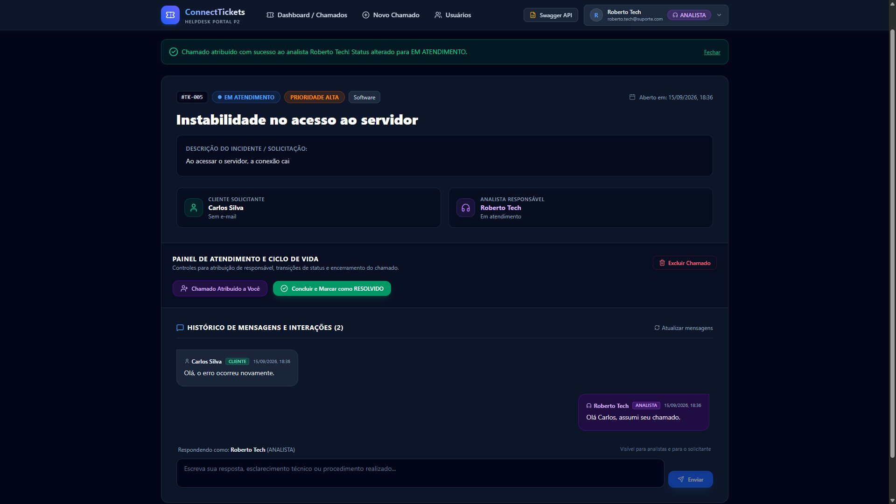
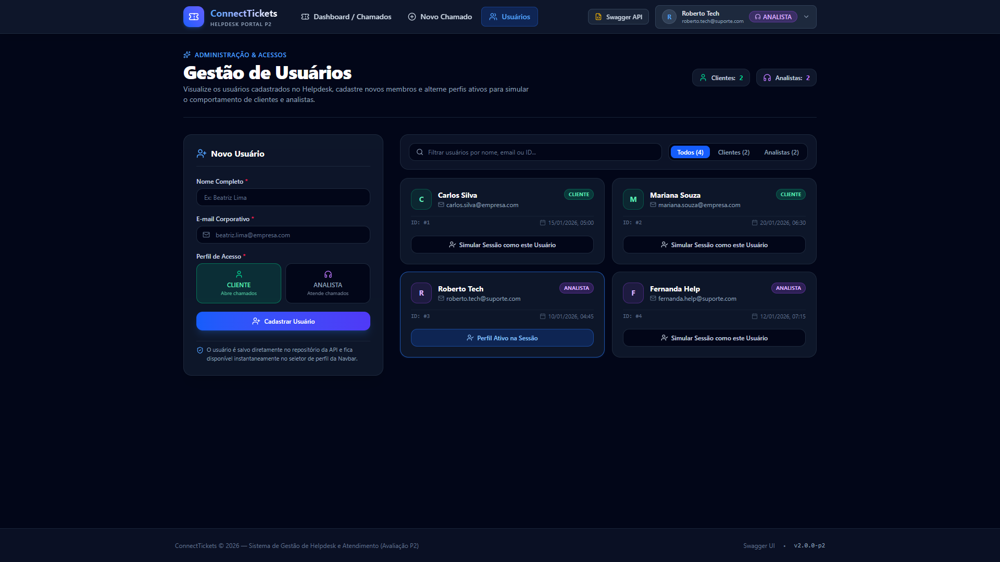

# 🎫 ConnectTickets — Sistema Helpdesk & Gestão de Tickets

<div align="center">


**Avaliações P1 & P2 — Engenharia de Software / Desenvolvimento Web 2026.1**  
*Fullstack Helpdesk: API RESTful Clean Architecture (P1) integrada a uma Single Page Application moderna em React.js + TypeScript (P2).*

</div>

---

## 📑 Sumário

- [1. Visão Geral do Projeto](#-1-visão-geral-do-projeto)
- [2. Avaliação P2 — Interface e Integração Front-end (SPA React)](#-2-avaliação-p2--interface-e-integração-front-end-spa-react)
  - [2.1 Tecnologia e Justificativa](#21-tecnologia-e-justificativa-arquitetural)
  - [2.2 Guia Visual de Telas e Funcionalidades](#22-guia-visual-de-telas-e-funcionalidades)
- [3. Perfis de Usuário e Matriz de Permissões](#-3-perfis-de-usuário-e-matriz-de-permissões)
- [4. Ciclo de Vida do Ticket](#-4-ciclo-de-vida-do-ticket)
- [5. Arquitetura do Sistema](#-5-arquitetura-do-sistema)
- [6. Guia Passo a Passo de Execução (Backend + Frontend)](#-6-guia-passo-a-passo-de-execução-backend--frontend)
- [7. Endpoints da API RESTful](#-7-endpoints-da-api-restful)
- [8. Guia de Testes da API (Swagger UI e Postman)](#-8-guia-de-testes-da-api)
- [9. Telas da Interface (Screenshots)](#-9-telas-da-interface-screenshots)
- [10. Dados Pré-Cadastrados (Seed Data)](#-10-dados-pré-cadastrados-seed-data)
- [11. Informações da Release v2.0.0-p2](#-11-informações-da-release-v200-p2)
- [12. Licença](#-12-licença)

---

## 📌 1. Visão Geral do Projeto

O **ConnectTickets** é uma solução completa de Service Desk / Helpdesk corporativo para gestão de incidentes de TI. O sistema centraliza a comunicação entre **Clientes** (usuários solicitantes) e **Analistas** (equipe técnica de suporte), assegurando rastreabilidade, triagem ágil, cumprimento de regras de negócio e histórico de interações.

---

## 💻 2. Avaliação P2 — Interface e Integração Front-end (SPA React)

### 2.1 Tecnologia e Justificativa Arquitetural

Para a **Avaliação P2**, foi adotada a arquitetura **SPA (Single Page Application)** desenvolvida com:
- **React.js 19 + TypeScript:** Criação de componentes reativos, fortemente tipados e desacoplados.
- **Vite:** Build tool ultrarrápida com Hot Module Replacement (HMR).
- **Tailwind CSS:** Framework utilitário moderno para um design responsivo, elegante em modo escuro (*Dark Mode*), com estados visuais e micro-interações fluidas.
- **Axios:** Cliente HTTP configurado com base URL dinâmica (`/api/v1`) e tratamento de erros padronizado.
- **React Router:** Navegação cliente fluida sem recarregamento de página.
- **Lucide React:** Biblioteca de ícones moderna e consistente.

**Justificativa da Escolha:**  
A P1 consistiu na concepção e homologação de uma API RESTful completa com Swagger e OpenAPI. A SPA em React consome 100% dessas rotas nativas (`/api/v1/tickets`, `/api/v1/usuarios`, etc.) via requisições assíncronas com **CORS habilitado**, proporcionando uma experiência de Helpdesk em tempo real (filtros instantâneos, timeline de mensagens, métricas automáticas e alternância de perfis em um clique).

---

### 2.2 Guia Visual de Telas e Funcionalidades

| Tela / Recurso | Descrição e Regras de Negócio Implementadas | Rota Frontend |
|---|---|:---:|
| **Navbar & Seletor de Perfil Ativo** | Cabeçalho fixo com logotipo, links de navegação, acesso direto ao **Swagger UI** e um dropdown interativo de **Simulação de Perfil** (permite alternar em 1 clique entre Clientes e Analistas para testar bloqueios e permissões). | Global |
| **Dashboard de Chamados** | Métricas no topo (**Total de Chamados**, **Abertos**, **Em Atendimento** e **Resolvidos**). Barra de filtros combinados por **Status**, **Prioridade**, busca em tempo real e botão rápido **"Apenas Pendentes"** (`GET /tickets/pendentes`). Listagem em cards com badges coloridas por prioridade e status. | `/` |
| **Abertura de Chamado** | Formulário validado com campos de Título, Categoria, Prioridade, Cliente Solicitante (pré-preenchido com o usuário ativo) e Descrição. Disparo de `POST /tickets`, feedback visual e redirecionamento automático para o ticket criado. | `/novo-ticket` |
| **Detalhes, Atendimento e Chat** | Exibição das informações completas do ticket. **Painel do Analista:** botões para *"Assumir Chamado"* (`PATCH /atribuir`), *"Mudar para Em Atendimento"* ou *"Marcar como Resolvido"* (`PATCH /status`), e modal de confirmação para exclusão (`DELETE /tickets/:id`). Bloqueio visual para usuários Clientes. **Chat de Mensagens:** timeline diferenciada entre Cliente e Analista, formulário de envio de novas mensagens (`POST /mensagens`) e congelamento automático quando o chamado é `RESOLVIDO`. | `/tickets/:id` |
| **Gestão de Usuários** | Listagem de Clientes e Analistas cadastrados no sistema, com visualização de ID, email e data. Formulário de cadastro imediato de novos usuários (`POST /usuarios`) e botão para simular a sessão com o usuário selecionado. | `/usuarios` |

---

## 👥 3. Perfis de Usuário e Matriz de Permissões

| Operação / Endpoint | Perfil `CLIENTE` | Perfil `ANALISTA` | Regra de Validação |
|---|:---:|:---:|---|
| **Abrir novo chamado** (`POST /api/v1/tickets`) | ✅ **Permitido** | ❌ **Bloqueado** | Apenas usuários com perfil `CLIENTE` podem ser o solicitante do ticket. |
| **Listar / Consultar chamados** | ✅ **Permitido** | ✅ **Permitido** | Visualização completa de chamados e métricas no Dashboard. |
| **Fila de pendentes** (`GET /api/v1/tickets/pendentes`) | ✅ **Permitido** | ✅ **Permitido** | Retorna chamados nos status `ABERTO` e `EM_ATENDIMENTO`. |
| **Assumir chamado** (`PATCH /tickets/:id/atribuir`) | ❌ **Bloqueado** | ✅ **Permitido** | Vincula o analista ativo e altera o status automaticamente para `EM_ATENDIMENTO`. |
| **Alterar status / Resolver** (`PATCH /tickets/:id/status`) | ❌ **Bloqueado** | ✅ **Permitido** | Apenas analistas têm permissão para conduzir o chamado até `RESOLVIDO`. |
| **Enviar mensagem em ticket ativo** (`POST /tickets/:id/mensagens`) | ✅ **Permitido** | ✅ **Permitido** | Interação registrada no chat com autor e perfil. |
| **Enviar mensagem em ticket resolvido** | ❌ **Bloqueado** | ❌ **Bloqueado** | Tickets com status `RESOLVIDO` bloqueiam novas mensagens. |
| **Cadastrar novo usuário** (`POST /api/v1/usuarios`) | ✅ **Permitido** | ✅ **Permitido** | Cadastra novos clientes e analistas sem e-mails duplicados. |

---

## 🔄 4. Ciclo de Vida do Ticket



---

## 🏛️ 5. Arquitetura do Sistema

```text
ConnectTickets/
├── frontend/                                      # Aplicação SPA React (P2)
│   ├── src/
│   │   ├── components/
│   │   │   └── Navbar.tsx                         # Navegação e Seletor de Perfil
│   │   ├── context/
│   │   │   └── UserContext.tsx                    # Gestão de Estado Global do Usuário
│   │   ├── pages/
│   │   │   ├── DashboardPage.tsx                  # Métricas e Filtros Dinâmicos
│   │   │   ├── NovoTicketPage.tsx                 # Formulário de Abertura de Ticket
│   │   │   ├── TicketDetalhesPage.tsx             # Atendimento, Status e Chat
│   │   │   └── UsuariosPage.tsx                   # Gestão e Cadastro de Usuários
│   │   ├── services/
│   │   │   └── api.ts                             # Instância do Axios conectada à API
│   │   ├── types/
│   │   │   └── index.ts                           # Tipagens TypeScript do Frontend
│   │   └── utils/
│   │       └── formatters.ts                      # Formatadores de status, cores e datas
│   ├── package.json
│   └── vite.config.ts
├── src/                                           # Backend Node.js / Express (P1)
│   ├── entities/                                  # Entidades puras de domínio
│   ├── repositories/                              # Interfaces de repositório
│   ├── services/                                  # Casos de uso e regras de negócio
│   └── infrastructure/
│       ├── database/                              # Repositórios em memória com Seed
│       └── http/
│           ├── routes/                            # Rotas Express v1
│           └── server.ts                          # Servidor Express com CORS habilitado
├── wireframes/                                    # Protótipos visuais SVG da P1
├── package.json                                   # Scripts da raiz (dev, dev:client, build)
└── README.md
```

---

## 🚀 6. Guia Passo a Passo de Execução (Backend + Frontend)

### 📋 Pré-requisitos
- **Node.js** (versão 18.x ou superior recomendada)
- **npm** (versão 9.x ou superior)

---

### 🖥️ Execução em Dois Terminais Paralelos

Para iniciar a aplicação completa, abra **dois terminais**:

#### 🔹 Terminal 1 — Backend Node.js (API RESTful)
```bash
# Na pasta raiz do projeto:
npm install
npm run dev
```
- 🚀 **API RESTful:** `http://localhost:3000`
- 📚 **Swagger UI Interativo:** `http://localhost:3000/api-docs`
- 📄 **OpenAPI JSON:** `http://localhost:3000/api-docs/json`

#### 🔹 Terminal 2 — Frontend React (SPA Vite)
```bash
# Entre na pasta do frontend:
cd frontend
npm install
npm run dev
```
- 🌐 **Interface Web ConnectTickets:** `http://localhost:5173`

---

### 🏗️ Scripts de Compilação (Build)

Para validar a tipagem e compilar ambos os projetos para produção:

```bash
# 1. Compilação do Backend (TypeScript -> dist/)
npm run build

# 2. Compilação do Frontend (Vite -> frontend/dist/)
npm run build:client
# ou diretamente dentro da pasta frontend:
# cd frontend && npm run build
```

---

## 📡 7. Endpoints da API RESTful

Todas as rotas da API possuem o prefixo base `/api/v1`:

| Método | Endpoint | Descrição | Status Sucesso | Status Erro |
|:---:|---|---|:---:|:---:|
| **GET** | `/api/v1/usuarios` | Lista todos os usuários (suporta `?perfil=CLIENTE` ou `ANALISTA`) | `200 OK` | `400` |
| **GET** | `/api/v1/usuarios/:id` | Busca detalhes de um usuário por ID | `200 OK` | `404`, `400` |
| **POST** | `/api/v1/usuarios` | Cadastra um novo usuário (`nome`, `email`, `perfil`) | `201 Created` | `400` |
| **GET** | `/api/v1/tickets` | Lista tickets com filtros opcionais (`?status=`, `?prioridade=`, `?clienteId=`, `?analistaId=`) | `200 OK` | `400` |
| **GET** | `/api/v1/tickets/pendentes` | Fila de chamados pendentes (`ABERTO` e `EM_ATENDIMENTO`) com filtro `?prioridade=` | `200 OK` | `400` |
| **GET** | `/api/v1/tickets/:id` | Detalhes completos do ticket (dados do cliente, analista e mensagens) | `200 OK` | `404`, `400` |
| **POST** | `/api/v1/tickets` | Abertura de chamado (exclusivo para perfil `CLIENTE`) | `201 Created` | `400` |
| **PATCH** | `/api/v1/tickets/:id/atribuir` | Atribui analista ao ticket (muda status para `EM_ATENDIMENTO`) | `200 OK` | `400`, `404` |
| **PATCH** | `/api/v1/tickets/:id/status` | Altera status (`ABERTO` $\rightarrow$ `EM_ATENDIMENTO` $\rightarrow$ `RESOLVIDO`). Exige analista | `200 OK` | `400`, `404` |
| **DELETE** | `/api/v1/tickets/:id` | Exclui um ticket do sistema | `204 No Content` | `404`, `400` |
| **GET** | `/api/v1/tickets/:id/mensagens` | Lista histórico cronológico de mensagens do ticket | `200 OK` | `404`, `400` |
| **POST** | `/api/v1/tickets/:id/mensagens` | Adiciona nova mensagem no chamado (`autorId`, `conteudo`) | `201 Created` | `400`, `404` |
| **GET** | `/api-docs` | Interface gráfica interativa do **Swagger UI** | `200 OK` | - |
| **GET** | `/api-docs/json` | Especificação OpenAPI em formato JSON | `200 OK` | - |

---

## 🧪 8. Guia de Testes da API

### Opção A: Testar via Swagger UI (Navegador)
1. Com o backend rodando (`npm run dev`), acesse:  
   👉 **[http://localhost:3000/api-docs](http://localhost:3000/api-docs)**
2. Selecione qualquer endpoint $\rightarrow$ **Try it out** $\rightarrow$ **Execute**.

### Opção B: Testar via Coleção Postman
1. Importe o arquivo [`ConnectTickets.postman_collection.json`](./ConnectTickets.postman_collection.json) no Postman.
2. Execute a suíte de testes com asserções automatizadas.

---

## 📸 9. Telas da Interface (Screenshots)

### 📊 Painel Geral de Tickets


### ➕ Abertura de Chamado


### 💬 Atendimento & Chat em Tempo Real


### 👥 Gestão de Usuários


> 📖 Para a matriz técnica de mapeamento de cada componente de tela com as rotas RESTful da API, consulte [`docs/WIREFRAMES.md`](./docs/WIREFRAMES.md).

---

## 🧪 10. Dados Pré-Cadastrados (Seed Data)

### Usuários de Exemplo:
- **ID 1:** `Carlos Silva` (`CLIENTE`) — `carlos.silva@empresa.com`
- **ID 2:** `Mariana Souza` (`CLIENTE`) — `mariana.souza@empresa.com`
- **ID 3:** `Roberto Tech` (`ANALISTA`) — `roberto.tech@suporte.com`
- **ID 4:** `Fernanda Help` (`ANALISTA`) — `fernanda.help@suporte.com`

### Tickets de Exemplo:
- **ID 1:** *"Falha na conexão com a VPN corporativa"* (`Redes` / `ALTA` / `ABERTO` / Cliente: 1)
- **ID 2:** *"Computador não liga após queda de energia"* (`Hardware` / `CRITICA` / `EM_ATENDIMENTO` / Cliente: 2 / Analista: 3)
- **ID 3:** *"Solicitação de licença do software CAD"* (`Software` / `MEDIA` / `RESOLVIDO` / Cliente: 1 / Analista: 4)
- **ID 4:** *"Redefinição de senha do portal de RH"* (`Acesso` / `BAIXA` / `ABERTO` / Cliente: 2)

---

## 🏷️ 11. Informações da Release v2.0.0-p2

- **Tag:** `v2.0.0-p2`
- **Título:** `Entrega P2 - Interface SPA React`
- **Descrição:** Relatório com detalhamento da tecnologia escolhida (SPA com React.js + TypeScript + Vite + Tailwind CSS), guia passo a passo para inicialização local e link para o vídeo demonstrativo de funcionamento e validação das regras de negócio.

---

## 📄 12. Licença

Este projeto é distribuído sob a licença **MIT**. Consulte o arquivo [`LICENSE`](./LICENSE) para mais informações.