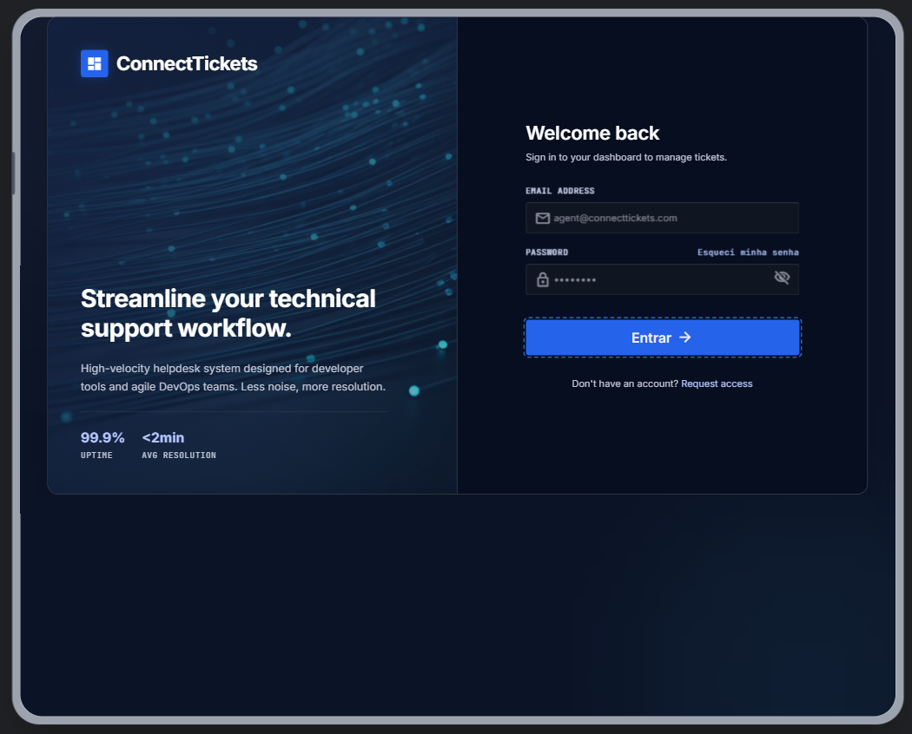
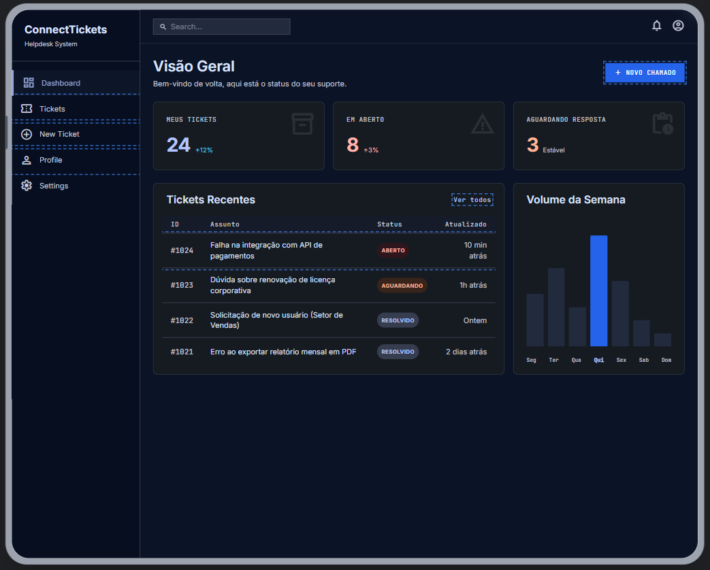
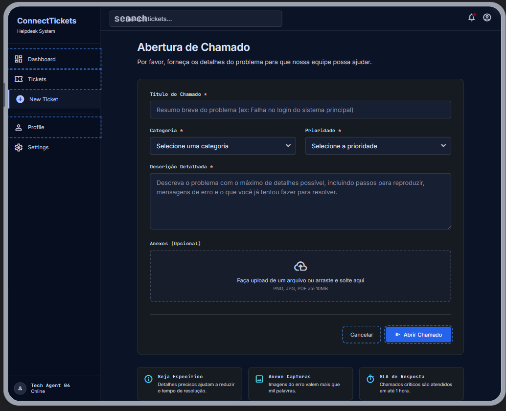
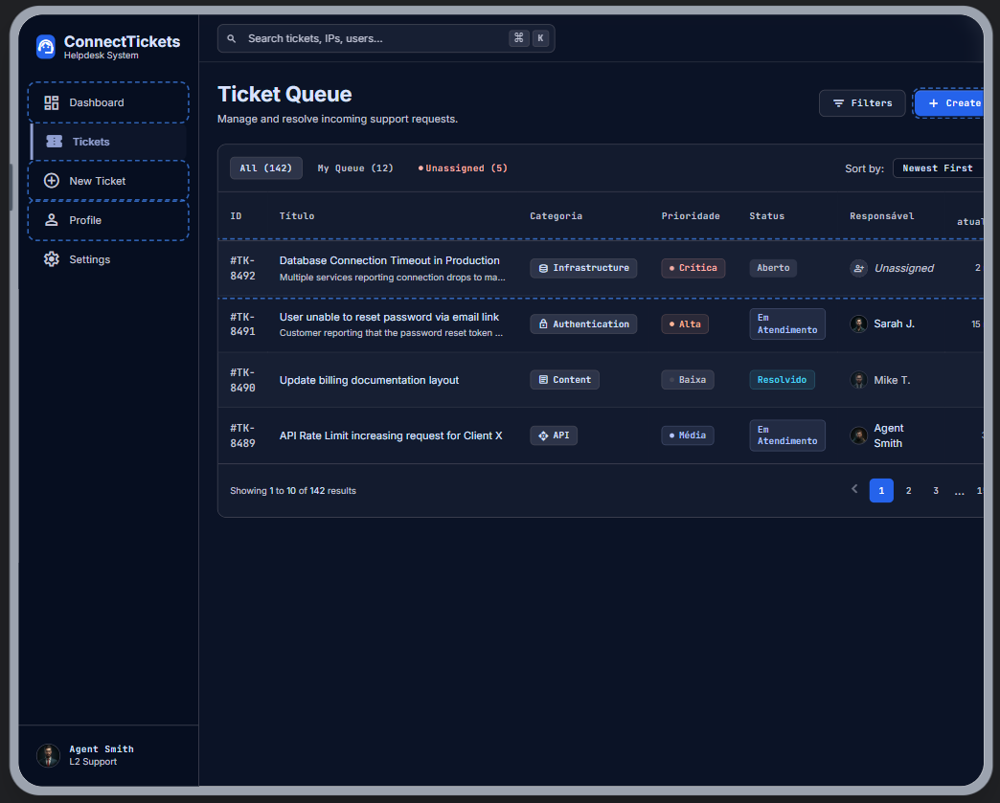
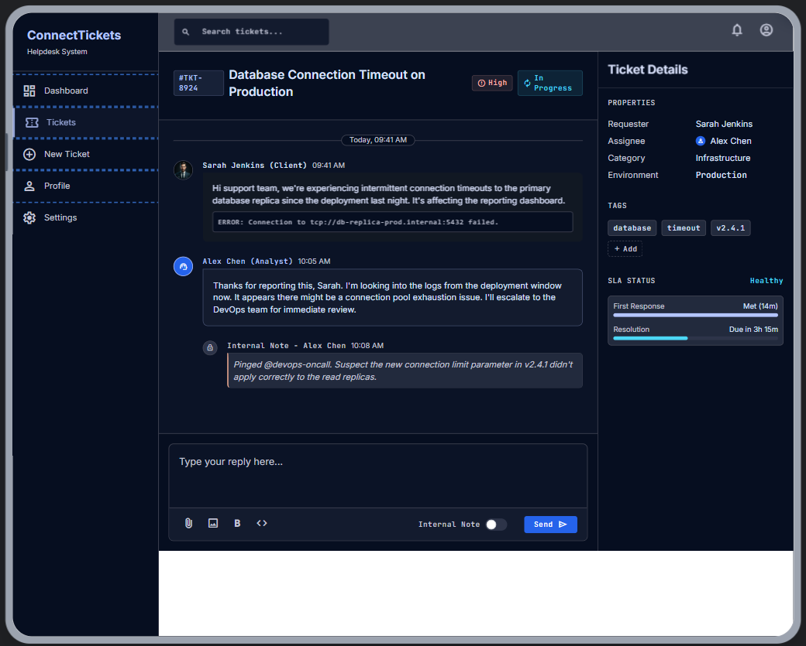
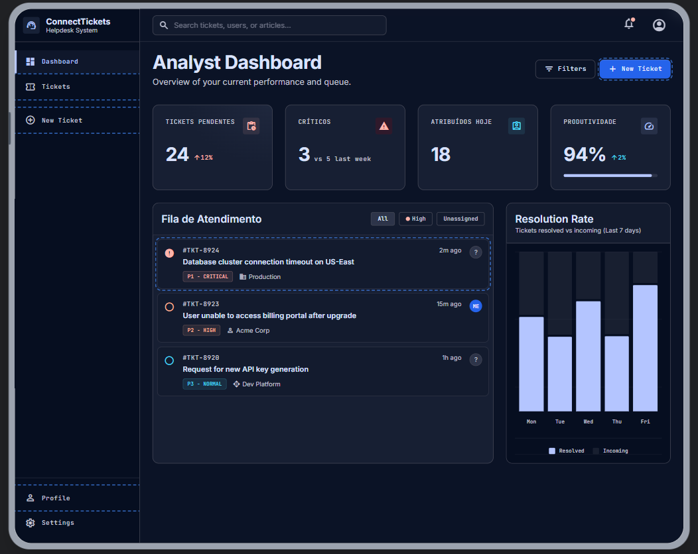
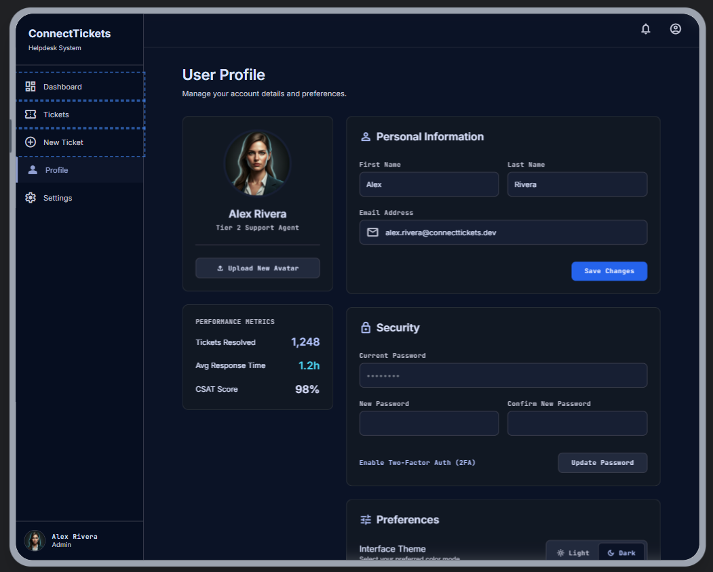

# FUNCIONALIDADES PRINCIPAIS

## 1. Tela de Login

Criar:

* login moderno dividido em duas colunas
* lado esquerdo com branding/ilustração tecnológica
* lado direito com formulário
* campos:

  * email
  * senha
* botão “Entrar”
* opção “Esqueci minha senha”
* animações suaves
* suporte a dark mode

## 2. Dashboard Principal

Criar dashboard moderno estilo SaaS contendo:

* sidebar fixa
* topbar com pesquisa e perfil do usuário
* cards de métricas:

  * Tickets Abertos
  * Em Atendimento
  * Resolvidos
  * Alta Prioridade
* gráficos modernos
* lista de tickets recentes
* atalhos rápidos

## 3. Tela de Abertura de Chamado

Criar formulário elegante contendo:

* título do chamado
* categoria
* prioridade
* descrição detalhada
* upload de anexos
* botão “Abrir Chamado”

Categorias:

* Hardware
* Software
* Rede
* Acesso/Login
* Outros

Prioridades:

* Baixa
* Média
* Alta
* Crítica

## 4. Tela de Listagem de Tickets

Criar tabela moderna com:

* filtros laterais
* busca
* paginação
* status coloridos
* badges de prioridade
* ordenação
* responsividade

Colunas:

* ID
* Título
* Categoria
* Prioridade
* Status
* Responsável
* Última atualização

Status:

* Aberto
* Em Atendimento
* Resolvido

## 5. Tela de Detalhes do Ticket

Criar uma interface estilo chat/helpdesk contendo:

* informações do ticket
* timeline do chamado
* mensagens entre cliente e analista
* anexos
* alteração de status
* histórico completo
* campo de resposta rápida
* design semelhante a Slack/Discord/Jira comments

## 6. Painel do Analista

Criar dashboard exclusivo para analistas contendo:

* tickets pendentes
* tickets críticos
* tickets atribuídos
* produtividade
* métricas de resolução
* gráficos
* fila de atendimento

## 7. Perfil do Usuário

Criar:

* edição de perfil
* avatar
* alteração de senha
* preferências
* dark/light mode toggle

